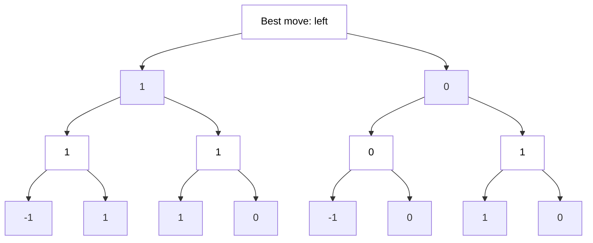
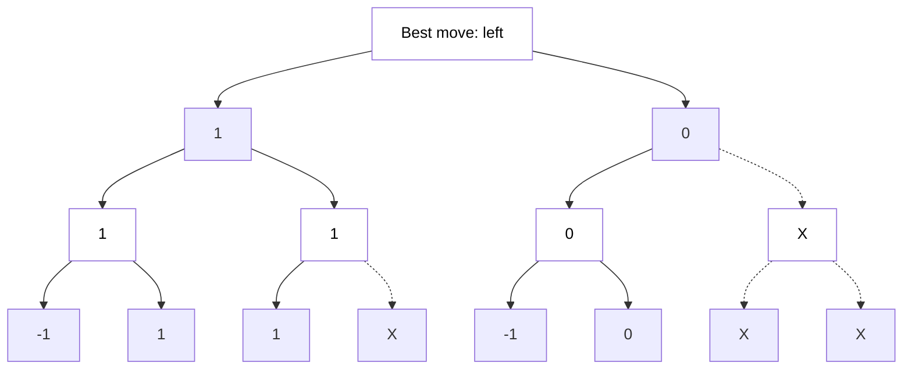

# PAIDTTT
## What is PAIDTTT?
Powerful AI Driven Tic-Tac-Toe is just a simple educational project created as a base for playing with some AI stuff.

## Features
- Tic-Tac-Toe game against CPU

## System requirements
- Linux / Windows
- Python interpreter

## Story

### Building base game
This part was rather straightforward so it doesn't make sense to write too much about it. Suffice it to mention that I used the turtle library to build the game, which is already a big improvement over last "Snake" written with curses (both due to improvement of graphics and work comfort...)  
&nbsp;

### AI - first attempt
At the beginning I decided to build a simple system based on a set of rules. For each of the possible moves, the computer was calculating the number of points received for taking advantageous positions (corners and center), for blocking the opponent and for a possible win. Additional points were awarded for forks - leading to a situation in which he can win in the next move by placing the symbol in more than one place (the situation cannot be blocked by the opponent, because he can only block one position in a single move).

```
+-----------+
|   |   | X |
+-----------+
| X | O |   |
+-----------+
| O |   | O |
+-----------+
```
> Sample fork for "O"

The computer played quite average, but not tragically. The upside was the fact that the next move was decided very quickly.  

However, I was not happy with his play, and it seemed a waste of time to develop the rules further (although it is possible to make a perfect player with this method). I decided to completely change my strategy  
&nbsp;

### Minimax algorithm
I reached for an algorithm that is often used in AI for chess - minimax. The principle of its operation is very simple - the function is called recursively, each time for the opposing player, actually simulating the possible course of the game. When the game ends or the algorithm reaches a defined depth, the situation on a board is evaluated.
If we write the first player's points as positive values, a draw situation as 0, and the opponent's points as negative values - then the first player will aim for the maximum positive result, and the second player will aim for the maximum negative result (or just minimum). In this way, in addition to the possible game itself, the algorithm can also simulate the decision-making process of each player (assuming that the player plays logically).


> Sample game - white is trying to get max, black is minimizing.

That was it! The computer was playing perfectly. You could only lose or draw with him.
But he was checking 549945 nodes to make a first move, which was, well... a lot. He was
playing awsome but he was thinking way to long. It was time for some optimization.  
&nbsp;

### Alpha-Beta pruning
Considering the fact that the first player is looking for the highest values, and the second player is looking for the lowest, we do not have to calculate all possible values in the tree, because we can assume that a given player will certainly choose another option (more beneficial for himself). This way, pruning branches can save a lot of calculation.


> Same result as before - less calculation.

This simple trick was more than enough. The number of nodes dropped from 549945 to just 30709 for the first move (from an average of 21.8s to make a move to just 1.29s) and from 7900 nodes to just 1500 for the second move (0.35s dropped to 0.12s). The result was fully satisfactory and the game - finally playable.